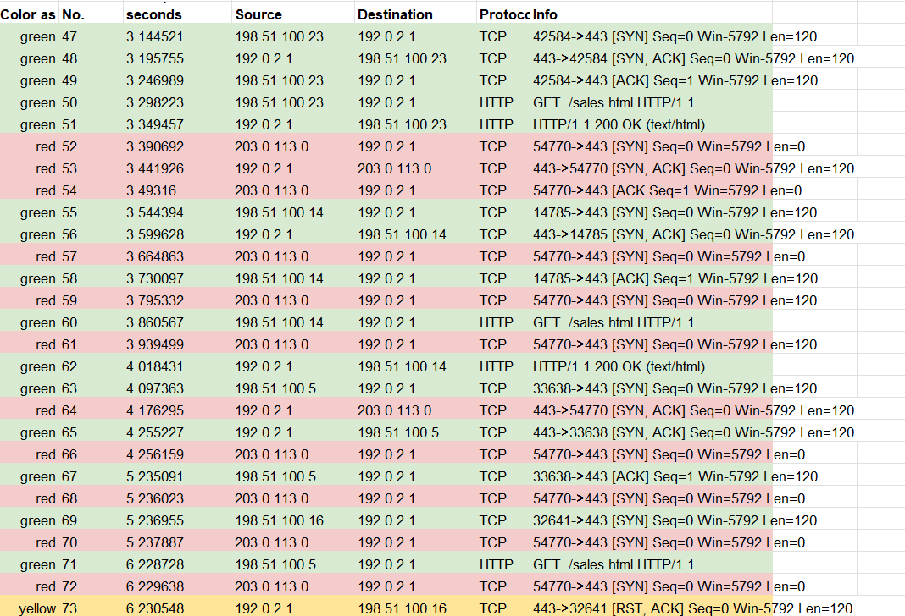
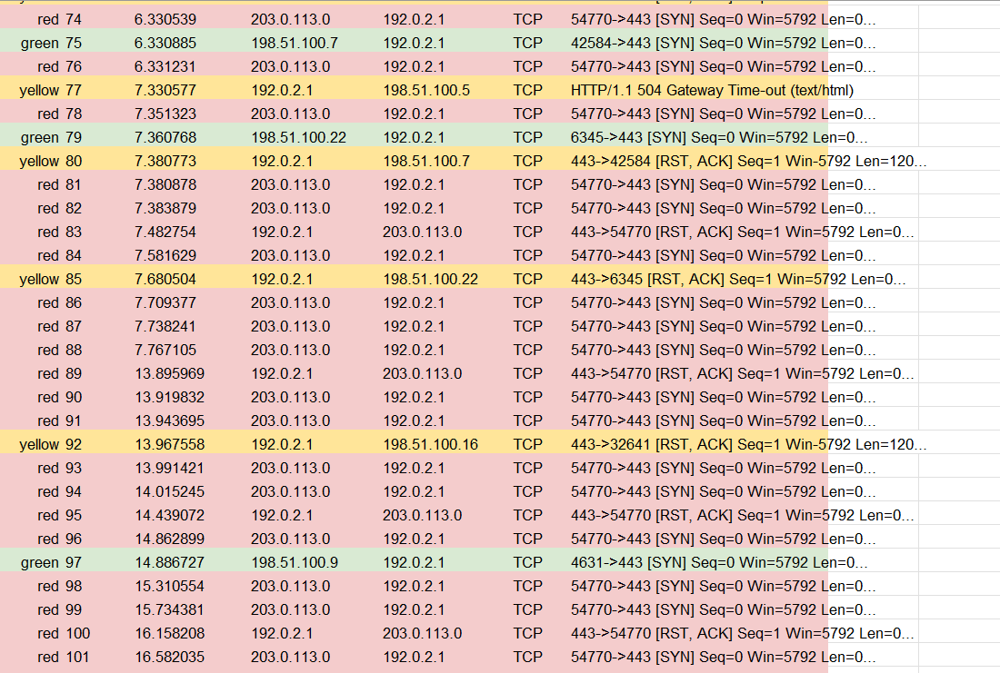
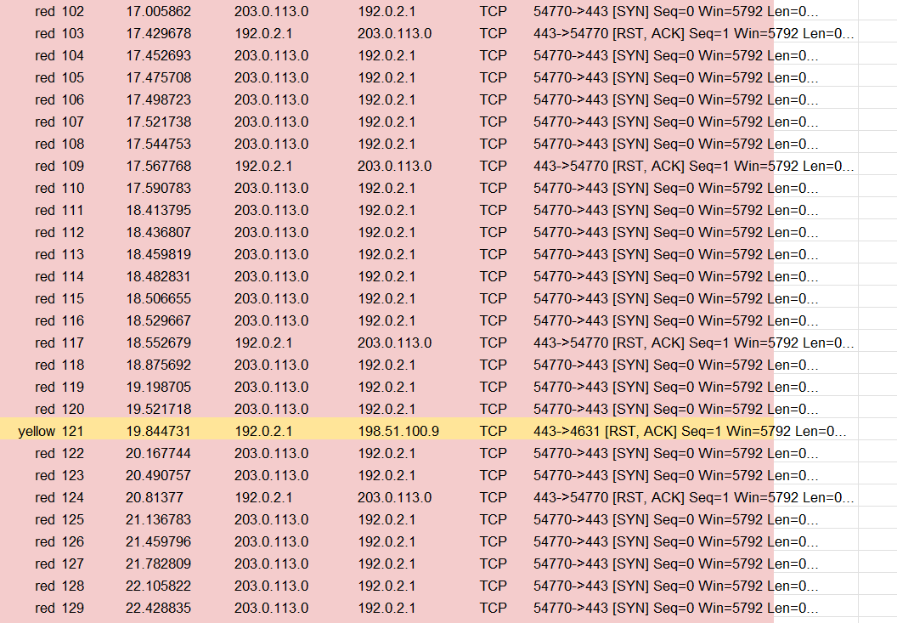
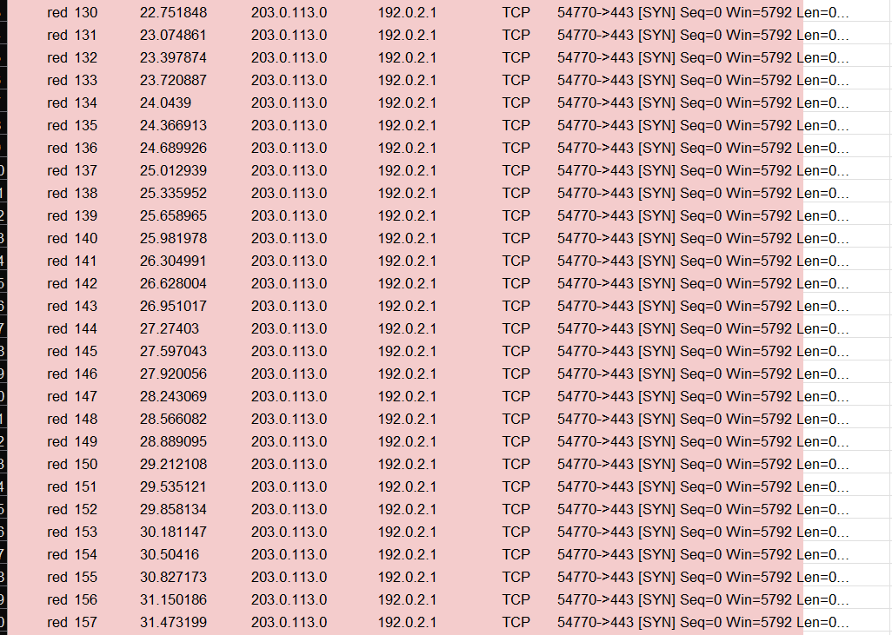
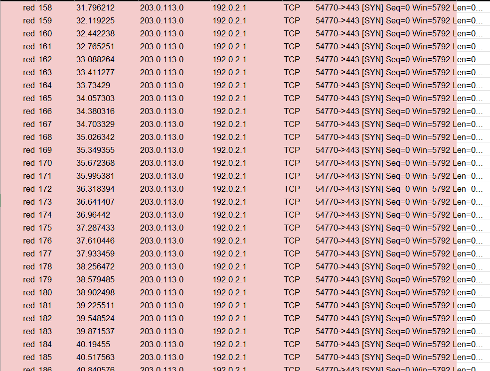
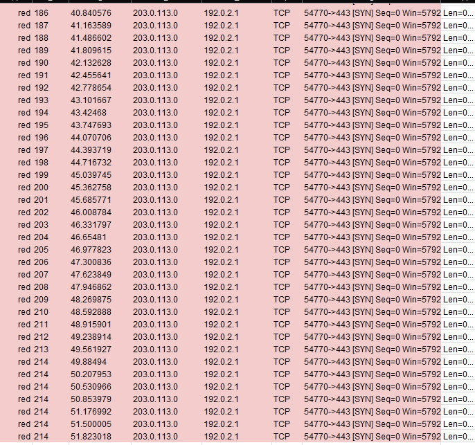

# Analiza los ataques en la red

*Trabajas como analista de seguridad para una agencia de viajes que anuncia ventas y promociones en el sitio web de la empresa. Los empleados de la empresa acceden regularmente a la página web de ventas de la empresa para buscar paquetes vacacionales que puedan gustar a sus clientes.*

*Una tarde, recibes una alerta automatizada de tu sistema de monitoreo que indica un problema con el servidor web. Intentas visitar el sitio web de la empresa, pero recibes un mensaje de error de tiempo de espera de conexión en tu navegador.*

*Utilizas un detector de paquetes para capturar los paquetes de datos en tránsito hacia y desde el servidor web. Observas un gran número de solicitudes TCP SYN procedentes de una dirección IP desconocida. El servidor web parece estar desbordado por el volumen de tráfico entrante y está perdiendo su capacidad para responder al número anormalmente grande de solicitudes SYN. Sospechas que el servidor está siendo atacado por un actor malicioso.*

*Desconectas temporalmente el servidor para que el equipo pueda recuperarse y volver a un estado de funcionamiento normal. También configuras el firewall de la empresa para bloquear la dirección IP que estaba enviando el número anormal de solicitudes SYN. Sabes que tu solución de bloqueo de IP no durará mucho, ya que un atacante puede suplantar otras direcciones IP para eludir este bloqueo. Tienes que alertar a tu gerente sobre este problema rápidamente y discutir los siguientes pasos para detener a este atacante y evitar que este problema vuelva a ocurrir. Tendrás que estar preparado para contarle a tu jefe el tipo de ataque que descubriste y cómo estaba afectando al servidor web y a los empleados.*

## Informe de incidentes de ciberseguridad

1. Identifica el tipo de ataque que puede haber causado esta interrupción en la red.
El tipo de ataque que estamos presenciando es un ataque de tipo inundación sincronizada, consiste en enviar muchas peticiones SYN al servidor aumentando el trafico y que le tome tiempo en responder las solicitudes

2. Explica como el ataque esta provocando que el sitio web no funcione como debería.
La gran cantidad de peticiones SYN saturan el trafico de red que cuse que el tiempo de respuesta sea muy alto
una de las principales afectaciones que se tienen es el problema de disponibilidad de la pagina web, que si esta en la nube puede incrementar costos y al ser una pagina de viajes puede tener importantes perdidas económicas

- Alguna sugerencia
tener un método para asegurar que las conexiones son legitimas o por automatizar con si alguna IP esta solicitando con demasiada frecuencia solitudes SYN bloquearla, ahorita lo que se puede hacer es bloquearla manualmente.

**Evidencias**
Como evidencia principal tenemos el trafico de paquetes que se han enviado en un periodo aproximado de un minuto

Podemos notar que la siguiente IP `203.0.113.0` estuvo realizando varias peticiones SYN a el servidor con la siguiente dirección `192.0.2.1` en el paquete numero 71 solicito la siguiente ip `198.51.100.5`ver información de la pagina pero en el paquete numero 77 el servidor envio la respuesta http 504 que indica que el servidor ha tardado tiempo en dar una respuesta causado por la gran cantidad de trafico.

durante ese momento el atacante realizo más de 100 peticiones SYN